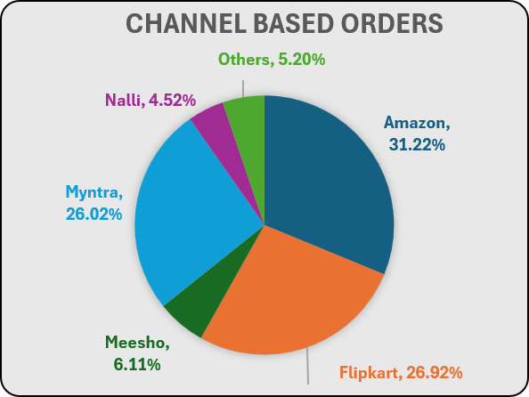
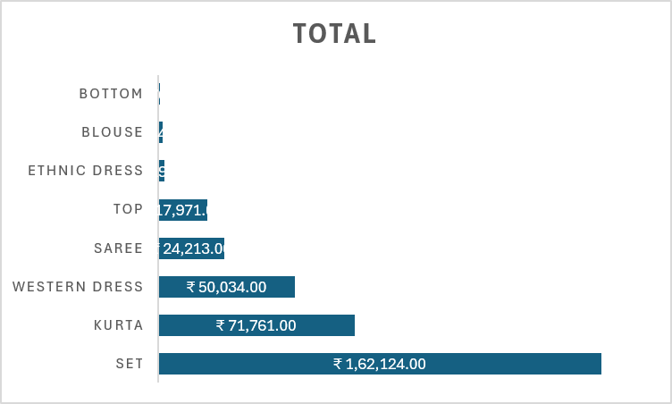

# E-Commerce Sales Analysis Dashboard — 2022


This project is an analysis of e-commerce sales data for 2022 using Microsoft Excel.

I worked with transaction data to understand how sales performed during the year, which customers contributed more to sales, which categories and sales channels performed well, and which states generated the most sales.

The project includes data preparation, Pivot Table analysis, charts, and an interactive Excel dashboard.

The main purpose was to take raw sales data and turn it into something that is easier to understand and useful for making business decisions.

---

## What I Wanted to Find

While working on the project, I focused on these questions:

* Which month had the highest sales?
* Which month had the highest number of orders?
* Do men or women contribute more to sales?
* Which age group buys the most?
* Which sales channel performs the best?
* Which product category generates the most sales?
* Which states contribute the most sales?
* How many orders are delivered, returned, cancelled, or refunded?

---

## Dataset

The dataset contains **31,047 transaction records** with **21 columns** for the year 2022.

Some of the important columns are:

| Column           | Description                    |
| ---------------- | ------------------------------ |
| Order ID         | Unique order ID                |
| Cust ID          | Customer ID                    |
| Gender           | Customer gender                |
| Age              | Customer age                   |
| Age Group        | Customer age group             |
| Date             | Order date                     |
| Month            | Order month                    |
| Status           | Order status                   |
| Channel          | Sales channel                  |
| SKU              | Product/SKU                    |
| Category         | Product category               |
| Size             | Product size                   |
| Qty              | Quantity ordered               |
| Amount           | Order amount                   |
| Ship City        | Shipping city                  |
| Ship State       | Shipping state                 |
| Ship Postal Code | Shipping postal code           |
| Ship Country     | Shipping country               |
| B2B              | Business-to-business indicator |

---

## Tools Used

* Microsoft Excel
* Excel Tables
* Power Query
* Pivot Tables
* Charts
* Data analysis
* Excel Dashboard

---

## Workbook Structure

The Excel file is divided into three main sheets:

```text
Sales Report.xlsx
│
├── Data
├── Pivot Data
└── Dashboard
```

### Data

This sheet contains the original transaction-level data.

### Pivot Data

This sheet contains the summaries and calculations used for the analysis and dashboard.

### Dashboard

This is the final dashboard where the important numbers and charts are shown in one place.

---

## Analysis and Findings

### Monthly Sales and Orders

I compared sales and order activity for all 12 months of 2022.

**March was the best-performing month.**

* Sales: **₹1,928,066**
* Unique orders: **2,599**

This made March the strongest month in terms of both sales and order volume.

---

### Sales by Gender

Women contributed more sales than men.

| Gender |       Sales | Share |
| ------ | ----------: | ----: |
| Women  | ₹13,562,773 | 64.1% |
| Men    |  ₹7,613,604 | 35.9% |

Women generated around **64% of total sales**, while men contributed around **36%**.

---

### Sales by Age Group

The customers were divided into three age groups:

* Adult
* Teenager
* Senior

Adults generated the highest sales.

| Age Group |       Sales |
| --------- | ----------: |
| Adult     | ₹10,608,757 |
| Teenager  |  ₹6,412,858 |
| Senior    |  ₹4,154,762 |

The Adult group was clearly the largest contributor to sales.

---

### Order Status

The dataset has four main order statuses:

* Delivered
* Returned
* Cancelled
* Refunded

| Status    | Orders |
| --------- | -----: |
| Delivered | 26,356 |
| Returned  |  1,001 |
| Cancelled |    831 |
| Refunded  |    501 |

Most orders were delivered. Returned, cancelled, and refunded orders were much lower compared with delivered orders.

---

### Sales by Channel

I also compared the sales generated through different sales channels.

| Channel  |      Sales | Share |
| -------- | ---------: | ----: |
| Amazon   | ₹7,519,933 | 35.5% |
| Myntra   | ₹4,941,540 | 23.3% |
| Flipkart | ₹4,573,301 | 21.6% |
| Ajio     | ₹1,331,427 |  6.3% |
| Nalli    | ₹1,015,329 |  4.8% |
| Meesho   |   ₹927,606 |  4.4% |
| Others   |   ₹867,241 |  4.1% |

**Amazon was the top sales channel**, contributing 35.5% of total sales.

---

### Sales by Category

The product categories were compared based on sales amount.

| Category      |       Sales | Share |
| ------------- | ----------: | ----: |
| Set           | ₹10,507,546 | 49.6% |
| Kurta         |  ₹4,959,377 | 23.4% |
| Western Dress |  ₹3,148,836 | 14.9% |
| Top           |  ₹1,186,199 |  5.6% |
| Saree         |  ₹1,010,471 |  4.8% |
| Ethnic Dress  |    ₹195,256 |  0.9% |
| Blouse        |    ₹140,888 |  0.7% |
| Bottom        |     ₹27,804 |  0.1% |

The **Set** category was the biggest contributor, accounting for almost half of the total sales.

---

### Top States by Sales

I also checked which states generated the most sales.

The top five were:

1. Maharashtra — ₹2,990,221
2. Karnataka — ₹2,646,358
3. Uttar Pradesh — ₹2,104,659
4. Telangana — ₹1,712,439
5. Tamil Nadu — ₹1,678,877

Maharashtra had the highest sales among the states in the dataset.

---

## Overall Numbers

| Metric                     |       Value |
| -------------------------- | ----------: |
| Total Records              |      31,047 |
| Total Sales                | ₹21,176,377 |
| Unique Orders              |      28,471 |
| Unique Customers           |      28,437 |
| Average Transaction Amount |     ₹682.07 |
| Total Quantity             |      31,205 |

One important point is that the number of transaction rows is not the same as the number of orders or customers. Some orders can have more than one transaction row.

---

## Main Insights

After completing the analysis, these were the main things I found:

* **Women** generated most of the sales.
* **March** was the best month for both sales and orders.
* **Amazon** was the highest-performing sales channel.
* **Set** was the highest-selling category.
* **Adults** generated the most sales among the age groups.
* **Maharashtra** had the highest state-wise sales.
* Most orders were successfully **delivered**.

---

## What I Would Do From the Business Side

Based on these findings, a business could:

* Focus more on the customer groups that generate higher sales.
* Continue investing in strong channels such as Amazon, Myntra, and Flipkart.
* Promote the Set category through offers, bundles, and cross-selling.
* Run targeted campaigns in high-performing states.
* Look at weaker months and check why sales were lower.
* Track returned, cancelled, and refunded orders to find possible problems in the buying or delivery process.

These are recommendations based on the patterns I found in the dataset, not actual company decisions.

---

## Project Workflow

```text
Raw Data
   ↓
Data Preparation
   ↓
Pivot Tables
   ↓
Analysis
   ↓
Charts
   ↓
Excel Dashboard
   ↓
Insights
   ↓
Recommendations
```

---

## Dashboard

The final dashboard brings the main analysis together in one place.

### Dashboard Preview


```markdown
![Excel Sales Dashboard]!(screenshots/dashboard.png)
```

### Other Charts


```markdown
![Monthly Sales and Orders]!(screenshots/Monthly-Sales-and-Orders.png)





![State-wise Sales]!(screenshots/State-wise-Sales.png)
```

---

## Questions Answered by the Project

| Question                    | Answer      |
| --------------------------- | ----------- |
| Highest sales month?        | March       |
| Highest order volume month? | March       |
| Who contributed more sales? | Women       |
| Most common order status?   | Delivered   |
| Top sales channel?          | Amazon      |
| Top-selling category?       | Set         |
| Highest-selling age group?  | Adult       |
| Top state by sales?         | Maharashtra |

---

## Limitations

There are a few limitations to this analysis:

* The dataset only covers **2022**.
* Cost and profit data are not available, so actual profit or profit margin cannot be calculated.
* The analysis is limited to the information available in the dataset.
* One order can have multiple transaction rows, so row count should not be treated as order count.
* The dashboard is built in Excel and depends on the workbook structure.

---

## Future Improvements

If I continue working on this project, I would like to:

* Automate data cleaning and refresh using Power Query.
* Add profit and profit-margin analysis if cost data is available.
* Analyze repeat customers and customer retention.
* Build the same dashboard in Power BI.
* Store and analyze the data using SQL.
* Add monthly automated reporting.
* Add sales forecasting.
* Create more detailed customer segments.

---

## Project Files

```text
Sales-Report/
│
├── Sales Report.xlsx
├── README.md
└── screenshots/
    ├── dashboard.png
    ├── monthly-sales-orders.png
    ├── channel-sales.png
    ├── category-performance.png
    └── state-sales.png
```

---

## Author

**Shyam Singh**

GitHub: (https://github.com/1m-shyam01)

LinkedIn: www.linkedin.com/in/shyam-singh-190b7a2a6

Portfolio: https://shyam-analyst.vercel.app

---

## Final Note

This project helped me practice working with real transaction-level sales data in Excel.

I worked through the process from raw data to Pivot Tables, analysis, charts, and finally an interactive dashboard. The main goal was not just to create charts, but to understand what the numbers were actually showing about customers, products, sales channels, and locations.
